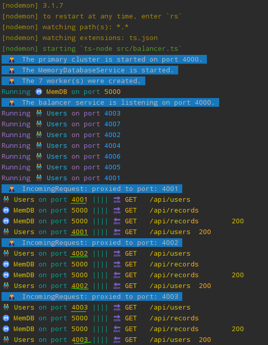

# Task: [Assignment: CRUD API](https://github.com/AlreadyBored/nodejs-assignments/blob/main/assignments/crud-api/assignment.md)

## Description

This task is implementation simple CRUD API using in-memory database underneath.

---

## Getting started
1. The node v22 required to installed on host machine [Download Node.js ®](https://nodejs.org/en/download/package-manager/current)
2. Ensure You have it installed and running with appropriate node version using `node -v` command in cli 
3. Fork or clone the [Crud-api-impl Repository](https://github.com/JsPowWow/rss-nodejs-2024Q3/tree/crud-api-impl)

---

### Install dependencies

```bash
npm ci
```

---

### Prerequisites

1. Create in root directory of this project the `.env` file.  
2. Copy all environment variables from `.env.example` to the newly created `.env` file.
   The content of the `.env` file should look like:
   ```dotenv
   # database in memory service port
    MEMORY_DB_SERVICE_PORT=5000

    # users service service port
    USERS_SERVICE_PORT=4000

    # load balancer port
    LOAD_BALANCER_PORT=4000
   ```
3. Happy testing 😋  

---

## Testing

### There are few cli commands prepared to run application in different mode

```bash
npm run start:dev
```

`npm run start:dev` is to run application in `standalone` mode. The `memory DB` and `users service`should start,
on appropriate ports which are defined in `.env` and ready to listening requests from `http://localhost:4000/api/users` endpoint.

---

```bash
npm run start:multi
```
`npm run start:multi` is to run application in `load-balancer` mode. 
The `primary cluster` and `memory DB`should start on appropriate ports which are defined in `.env`.
Depends on Your machine `availableParallelism` cpus count, appropriate amount of child workers with embedded `users service`'s
should start and running each listening on port `{LOAD_BALANCER_PORT + appropriate worker number}`.
Load balancer distributes requests across them (using Round-robin algorithm).
After all worker services are up and running - balancer is ready to listening requests from `http://localhost:4000/api/users` endpoint.


You can check the **production** versions by running appropriate:

#### Standalone
```bash
npm run start:prod
```

#### Balancer
```bash
npm run start:prod:multi
```

---

## Troubleshooting
You might face `ADDRINUSE` issues through testing, so next command(s) can help to kill running node sessions in `cli`

#### Windows Machine:
```bash
taskkill /f /im node.exe
```

#### Linux/MacOS machine:
```bash
killall node
```

---

## Implementation details

1. Implemented endpoint `http://localhost:4000/api/users`:
   - **GET** `http://localhost:4000/api/users` is used to get all persons
      - Server should answer with `status code` **200** and all users records
   - **GET** `http://localhost:4000/api/users/{userId}`
      - Server should answer with `status code` **200** and record with `id === userId` if it exists
      - Server should answer with `status code` **400** and corresponding message if `userId` is invalid (not `uuid`)
      - Server should answer with `status code` **404** and corresponding message if record with `id === userId` doesn't exist
   - **POST** `http://localhost:4000/api/users` is used to create record about new user and store it in database
      - Server should answer with `status code` **201** and newly created record
      - Server should answer with `status code` **400** and corresponding message if request `body` does not contain **required** fields
   - **PUT** `http://localhost:4000/api/users/{userId}` is used to update existing user
      - Server should answer with` status code` **200** and updated record
      - Server should answer with` status code` **400** and corresponding message if `userId` is invalid (not `uuid`)
      - Server should answer with` status code` **404** and corresponding message if record with `id === userId` doesn't exist
   - **DELETE** `http://localhost:4000/api/users/{userId}` is used to delete existing user from database
      - Server should answer with `status code` **204** if the record is found and deleted
      - Server should answer with `status code` **400** and corresponding message if `userId` is invalid (not `uuid`)
      - Server should answer with `status code` **404** and corresponding message if record with `id === userId` doesn't exist
2. Users are stored in as `objects` in the `memory DB` that have next properties:
   - `id` — unique identifier (`string`, `uuid`) generated on server side
   - `username` — user's name (`string`, **required**)
   - `age` — user's age (`number`, **required**)
   - `hobbies` — user's hobbies (`array` of `strings` or empty `array`, **required**)
3. Requests to non-existing endpoints (e.g. `some-non/existing/resource`) handled (server should answer with `status code` **404** and corresponding human-friendly message)
4. Errors on the server side that occur during the processing of a request handled and processed correctly (server should answer with `status code` **500** and corresponding human-friendly message)
5. Value of appropriate `port(s)` on which application is running is stored in `.env` file
6. There are two modes of running application (**development** and **production**):
7. There are a lot of tests for API
